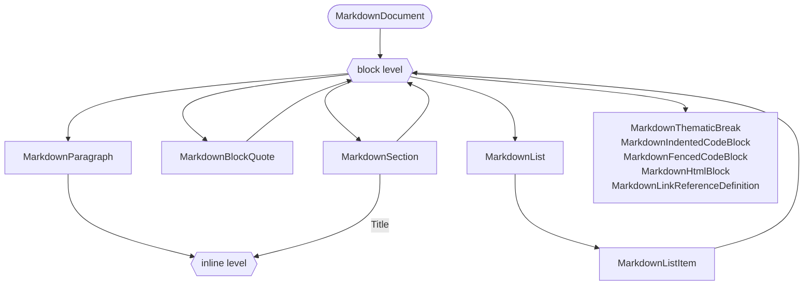

# Markdown object model — Design

The model is a tree of nodes. Block parsing produces the specification's block sequence, a grouping pass turns runs of blocks introduced by headings into section nodes, and inline parsing fills the leaf blocks. Rendering reverses the grouping, so the section tree changes how a document is *held*, never what it *emits*.

## Specification

[spec.md](spec.md).

## Approach

Every construct is a node deriving from `MarkdownNode`. `MarkdownBlock` and `MarkdownInline` add nothing of their own and exist so `$_ -is [MarkdownBlock]` is a usable filter.

`MarkdownSection` is a block node. It carries the heading that opens it — `Level`, `Title`, and `Style` — rather than containing a heading node, and holds everything that belongs to it — its own blocks, then its nested sections — in the same `Children` collection every other node uses. `MarkdownDocument` is the same container without a heading and with a frontmatter property.

```text
MarkdownDocument
├── FrontMatter : MarkdownFrontMatter        the metadata part, not a child node
└── Children
    ├── MarkdownParagraph                    content before the first heading
    └── MarkdownSection
        ├── Level : int                      the heading level, as written
        ├── Title : MarkdownInline[]         the heading text, as inline nodes
        ├── Style : MarkdownHeadingStyle     how the heading was written
        └── Children
            ├── MarkdownParagraph            content before the first subheading
            ├── MarkdownFencedCodeBlock
            └── MarkdownSection              recursive, empty for a leaf section
                ├── Level / Title / Style
                └── Children
```

`Title` holds inline nodes rather than a string, so `# Release **1.2** notes` keeps its emphasis and re-renders with it. A string would flatten heading markup with nothing left to recover it from. `GetTitleText()` reads a title as plain text for the callers that want one.

There is no separate heading node. With level, title, and style on the section, nothing in the model could hold one — a heading that introduces nothing is not something a document can express — so the heading's stylistic properties are section properties and `Descendants('Section')` is how headings are found.

Two recursion points remain from the ungrouped model — blocks inside blocks, inlines inside inlines — and sections add a third that reuses the first: a section is a block that contains blocks.



## Alternatives considered

### The section shape

| Option | Trade-offs | Verdict |
| --- | --- | --- |
| Flat block sequence, headings as siblings | Mirrors the specification exactly and needs no grouping pass. Every caller re-derives the outline by scanning forward for the next heading of the same or a lower level, and the level arithmetic is wrong at the edges more often than it is right. | Rejected — pushes the hardest part of the model onto every consumer |
| Section tree as a derived view over a flat model | Keeps the specification shape as the source of truth. Two representations of one document have to be kept in step, and a mutation through the view has to be written back, which is where this design breaks down. | Rejected — two sources of truth |
| `Blocks[]` and `Sections[]` as separate collections | Reads well and matches how the shape is drawn on a whiteboard. Traversal needs both collections, document order between the two is implicit rather than stored, and a filtered view of one collection under a second name puts the same node on two paths, which duplicates it in serialized output. | Rejected — breaks single-walk traversal and clean serialization |
| `Section { Heading, Children }` — the section wraps a heading node | Keeps a node for a construct CommonMark defines, and gives the heading line a source span of its own. Costs an indirection on the two most common accesses, needs a documented traversal rule for where the heading is yielded, and the node it preserves is one nothing else in the model can hold. | Rejected — the indirection buys a node nothing else references |
| `Header { Level, Title (string), Content }` — as prototyped in [PSModule/Markdown#18](https://github.com/PSModule/Markdown/pull/18) | The simplest containment shape, and proven to work across all three platforms. A string title discards inline markup in a heading, and the loss is unrecoverable once parsing has finished. | Rejected — lossy |
| `Section { Level, Title (inlines), Style, Children }`, `Children` as the only storage | One type, direct access to level and title, and no fidelity loss. Grouping happens once, at parse time, in one place, and document order is preserved by the collection itself. Costs one pass over the block sequence, and heading level is no longer readable from nesting depth. | **Chosen** |

## Architecture

### Node members

| Member | On | Purpose |
| --- | --- | --- |
| `[string] Type` | `MarkdownNode` | The construct name, stable across serialization |
| `[MarkdownNode[]] Children` | `MarkdownNode` | The only storage for contained nodes, in document order |
| `[MarkdownSourceSpan] Source` | `MarkdownNode` | Where the node was parsed from; `$null` for nodes built directly |
| `Descendants()` | `MarkdownNode` | Depth-first walk of the whole subtree |
| `Descendants([string] $type)` | `MarkdownNode` | The same walk, filtered by construct name |
| `Sections()` | `MarkdownNode` | The nested sections in `Children` |
| `Blocks()` | `MarkdownNode` | The blocks in `Children` that are not sections |
| `GetSection([string[]] $path)` | `MarkdownNode` | The section reached by matching title text at each step |
| `GetText()` | `MarkdownNode` | The plain text of the subtree, markup removed |
| `ToString()` | `MarkdownNode` | The Markdown for the subtree |
| `[int] Level` | `MarkdownSection` | The heading level, as written |
| `[MarkdownInline[]] Title` | `MarkdownSection` | The heading text, as inline nodes |
| `[MarkdownHeadingStyle] Style` | `MarkdownSection` | How the heading was written |
| `GetTitleText()` | `MarkdownSection` | The title as plain text, markup removed |
| `[MarkdownFrontMatter] FrontMatter` | `MarkdownDocument` | The metadata part |

`Sections()` and `Blocks()` are methods rather than properties. A property returning a filtered view of `Children` would put the same node under two names on one object, and `ConvertTo-Json`, `ConvertTo-Yaml`, and `Export-Clixml` would emit it twice — the duplication [NFR3](spec.md#nfr3) rules out. Methods are also how `Descendants()` already works, so the surface stays consistent.

`Title` is the one node-valued member outside `Children`, and `Descendants()` absorbs it: the walk yields a section's title inlines before its children. That is the single place traversal knows about a node type, and it lives inside the model so that no caller has to hold it. Without it, a query as ordinary as `$doc.Descendants('Link')` would silently miss every link written inside a heading.

### Sectioning

The grouping pass runs after block parsing, over the child block sequence of each block container, before inline parsing. It is the only place the outline rules of Markdown are expressed.

```text
sectionize(blocks):
    roots = []                       # blocks and sections at container level
    open  = []                       # open sections, heading levels strictly increasing

    for block in blocks:
        if block is a heading:
            while open is not empty and open.last.Heading.Level >= block.Level:
                remove open.last
            section = new Section(Heading = block)
            if open is empty: roots.add(section) else: open.last.Children.add(section)
            open.add(section)
        else:
            if open is empty: roots.add(block) else: open.last.Children.add(block)

    return roots
```

The consequences are the behaviour [FR6](spec.md#fr6) requires, and they follow from the algorithm rather than from special cases:

- Blocks before the first heading stay at container level, which is why the document holds content of its own.
- A heading closes every open section at its level or deeper, so a level rising again is ordinary rather than an error.
- A skipped level nests the deeper section directly under the shallower one. Nesting depth is therefore not the heading level, and `MarkdownHeading.Level` remains the only source of truth for rendering.
- A document that starts below level 1 needs no special handling: `open` is empty, so its first section is a root.

Running per container is what makes a heading inside a block quote or a list item section that container and nothing above it ([FR5](spec.md#fr5)).

### Rendering

A section emits its heading line, reconstructed from `Level`, `Title`, and `Style`, then its children in order. Because `Children` holds blocks and nested sections in document order, and because the level is read from the section rather than from its depth, the text produced for a document is identical to the text the ungrouped block sequence would produce. Conformance and the round-trip contract are therefore measured on exactly the same output as before sections existed.

### Addressing a section

`GetSection()` takes a path as a string array and matches each element against the plain text of the section title at that level — `$doc.GetSection('Usage', 'Parameters')`. An array rather than a delimited string, because a title may contain any character a delimiter could use. Matching is ordinal and case-insensitive, and the first match at each level wins; a path that matches nothing returns nothing rather than throwing, so it composes in a pipeline.

## Data and contracts

The model is the module's public contract, so its nodes are plain objects: public, typed, settable properties and no backing fields. That is what lets any general-purpose serializer take a parsed document and produce complete output, and what keeps the graph acyclic — no node holds a reference to its parent.

Validation is not performed in property setters. A node accepts a state it cannot render; the renderer throws on what it cannot express, and structural checking is a separate concern. Validating on assignment would require accessors and backing fields, which conflicts directly with plain serializable properties.

## Security

- Parsing accepts untrusted text. The grouping pass is linear in the number of blocks and holds one stack bounded by the number of open heading levels, so a hostile document cannot drive it into pathological time or unbounded memory.
- Nesting depth is bounded before recursion, so deeply nested input fails with a clear error rather than exhausting the stack.
- The model never resolves or fetches a link destination. Destinations are carried as text, and what is done with them is the caller's decision.

## Testing strategy

| Level | What it covers |
| --- | --- |
| Unit | The grouping pass in isolation: nesting, skipped levels, a level rising again, a document starting below level 1, content before the first heading, and headings inside a block quote and a list item |
| Unit | `Sections()`, `Blocks()`, `Descendants()`, and `GetSection()` against a document with sections three levels deep |
| Unit | A section title holding emphasis, a code span, and a link: the inlines are reachable from `Descendants()`, `GetTitleText()` strips the markup, and rendering restores it |
| Contract | Rendered output matches the ungrouped block sequence byte for byte, over the whole [commonmark-spec](https://github.com/commonmark/commonmark-spec) example set |
| Contract | Parse, render, parse again produces an equivalent model, and rendering the second model produces identical text |
| Contract | Converting a parsed document to JSON, YAML, and CLIXML completes with no duplicated node and no cycle |
| Performance | A 1,000-line document parses within the budget in [NFR2](spec.md#nfr2) |

## Rollout and operability

The model ships as one release, before which nothing depends on its shape. It is delivered in slices — node types, block parsing, the grouping pass, inline parsing, rendering — and the conformance suite runs in a known-failing mode until the parsing slices are complete. The release does not go out while the suite is red.

The composition DSL is untouched throughout. It writes Markdown; the model reads and transforms it. Whether the DSL is eventually reimplemented on top of the model is a separate question, deliberately left open.
