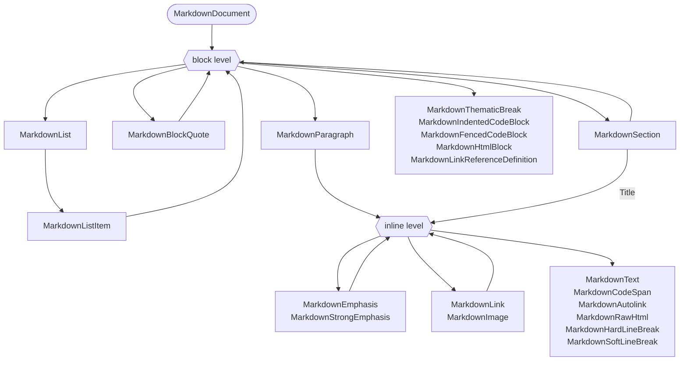
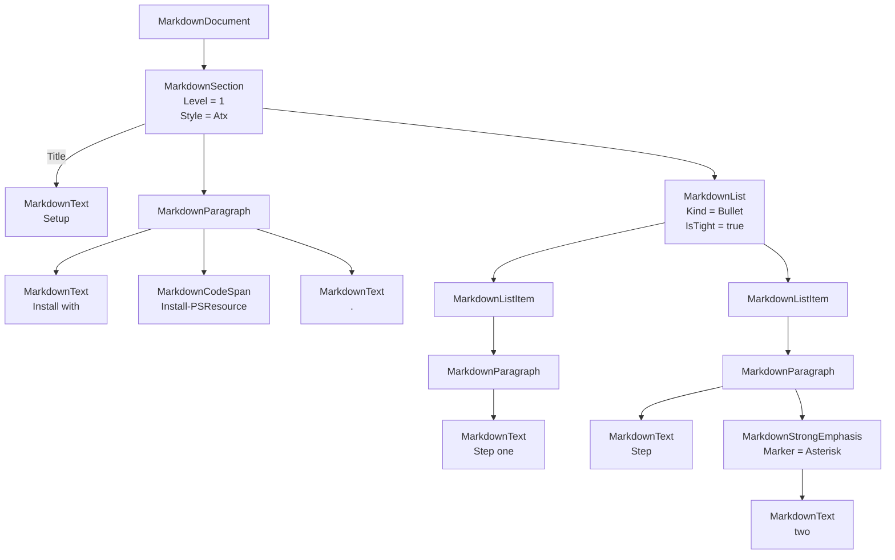
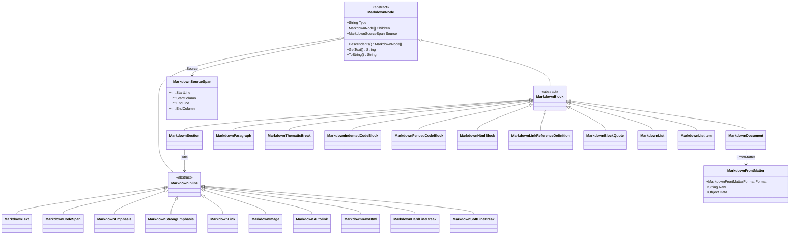

# Markdown object model — Design

The model is a tree of nodes. Block parsing produces the specification's block sequence, a grouping pass turns runs of blocks introduced by headings into section nodes, and inline parsing fills the leaf blocks. Rendering reverses the grouping, so the section tree changes how a document is *held*, never what it *emits*.

## Specification

[spec.md](spec.md).

## Approach

Every construct is a node deriving from `MarkdownNode`. `MarkdownBlock` and `MarkdownInline` add nothing of their own and exist so `$_ -is [MarkdownBlock]` is a usable filter.

`MarkdownSection` is a block node. It carries the heading that opens it — `Level`, `Title`, and `Style` — rather than containing a heading node, and holds everything that belongs to it — its own blocks, then its nested sections — in the same `Children` collection every other node uses. `MarkdownDocument` is the same container without a heading and with a frontmatter property.

```text
MarkdownDocument
├── FrontMatter : MarkdownFrontMatter        the metadata part, not a child node
└── Children
    ├── MarkdownParagraph                    content before the first heading
    └── MarkdownSection
        ├── Level : int                      the heading level, as written
        ├── Title : MarkdownInline[]         the heading text, as inline nodes
        ├── Style : MarkdownHeadingStyle     how the heading was written
        └── Children
            ├── MarkdownParagraph            content before the first subheading
            ├── MarkdownFencedCodeBlock
            └── MarkdownSection              recursive, empty for a leaf section
                ├── Level / Title / Style
                └── Children
```

`Title` holds inline nodes rather than a string, so `# Release **1.2** notes` keeps its emphasis and re-renders with it. A string would flatten heading markup with nothing left to recover it from. `GetTitleText()` reads a title as plain text for the callers that want one.

There is no separate heading node. With level, title, and style on the section, nothing in the model could hold one — a heading that introduces nothing is not something a document can express — so the heading's stylistic properties are section properties and `Descendants('Section')` is how headings are found.

Two recursion points remain from the ungrouped model — blocks inside blocks, inlines inside inlines — and sections add a third that reuses the first: a section is a block that contains blocks.



The type system does not enforce these rules. `Children` is `[MarkdownNode[]]` on every node, which is what lets one walk cover the whole tree and one serializer handle the result. The parser produces only valid nesting, and the renderer throws on nesting it cannot express.

### A worked example

This document:

```markdown
# Setup

Install with `Install-PSResource`.

- Step one
- Step **two**
```

parses to this model:



Four things this makes concrete. The document holds one child, and everything under `# Setup` hangs off it — the paragraph and the list are content *of the section*, not siblings of a heading. The heading itself is not a node: its level and style are section properties, and its text is the section's `Title`. List items contain *blocks*, so the content of a one-line item is still a paragraph. And emphasis contains inlines rather than a string, which is why `**two**` is a `MarkdownStrongEmphasis` wrapping a `MarkdownText`.

## Alternatives considered

### The section shape

| Option | Trade-offs | Verdict |
| --- | --- | --- |
| Flat block sequence, headings as siblings | Mirrors the specification exactly and needs no grouping pass. Every caller re-derives the outline by scanning forward for the next heading of the same or a lower level, and the level arithmetic is wrong at the edges more often than it is right. | Rejected — pushes the hardest part of the model onto every consumer |
| Section tree as a derived view over a flat model | Keeps the specification shape as the source of truth. Two representations of one document have to be kept in step, and a mutation through the view has to be written back, which is where this design breaks down. | Rejected — two sources of truth |
| `Blocks[]` and `Sections[]` as separate collections | Reads well and matches how the shape is drawn on a whiteboard. Traversal needs both collections, document order between the two is implicit rather than stored, and a filtered view of one collection under a second name puts the same node on two paths, which duplicates it in serialized output. | Rejected — breaks single-walk traversal and clean serialization |
| `Section { Heading, Children }` — the section wraps a heading node | Keeps a node for a construct CommonMark defines, and gives the heading line a source span of its own. Costs an indirection on the two most common accesses, needs a documented traversal rule for where the heading is yielded, and the node it preserves is one nothing else in the model can hold. | Rejected — the indirection buys a node nothing else references |
| `Header { Level, Title (string), Content }` — as prototyped in [PSModule/Markdown#18](https://github.com/PSModule/Markdown/pull/18) | The simplest containment shape, and proven to work across all three platforms. A string title discards inline markup in a heading, and the loss is unrecoverable once parsing has finished. | Rejected — lossy |
| `Section { Level, Title (inlines), Style, Children }`, `Children` as the only storage | One type, direct access to level and title, and no fidelity loss. Grouping happens once, at parse time, in one place, and document order is preserved by the collection itself. Costs one pass over the block sequence, and heading level is no longer readable from nesting depth. | **Chosen** |

## Architecture

The schema below is the complete node inventory: every class, every property, and the specification section it derives from. Properties marked *style* exist only so the renderer can reproduce the source form; they carry no semantic content, and a consumer that does not render Markdown can ignore them.

### Type hierarchy

Three levels, and `Type` as a plain string on each node — `Section`, `Paragraph`, `Text`, without the `Markdown` prefix — so `Where-Object Type -EQ 'Section'` works without class names in scope and `ConvertTo-Json` output is self-describing.



CommonMark's prose separates *container* blocks from *leaf* blocks, but that is a parsing concept rather than a modelling one, so the class hierarchy does not reflect it. The block and inline split is kept because filtering on it is genuinely useful.

`MarkdownFrontMatter` and `MarkdownSourceSpan` are not nodes. They hang off nodes as properties and never appear in `Children`.

### Shared members

`MarkdownNode` is the abstract base of every node. `MarkdownBlock` and `MarkdownInline` derive from it and add nothing.

| Member | Type | Notes |
| --- | --- | --- |
| `Type` | `[string]` | The node name without the `Markdown` prefix. Read-only. |
| `Children` | `[MarkdownNode[]]` | Direct children in document order. Empty for leaves, never `$null`. |
| `Source` | `[MarkdownSourceSpan]` | Where the node came from in the source text. `$null` for nodes built by hand. |
| `Descendants()` | `[MarkdownNode[]]` | Every node beneath this one, depth-first, document order. A section's title inlines are yielded before its children. |
| `Descendants([string] $type)` | `[MarkdownNode[]]` | The same, filtered to one `Type`. |
| `GetText()` | `[string]` | Concatenated text content of the subtree, markup stripped. |
| `ToString()` | `[string]` | The subtree rendered as Markdown, by delegating to the renderer. |
| `Sections()` | `[MarkdownSection[]]` | The nested sections in `Children`. |
| `Blocks()` | `[MarkdownBlock[]]` | The blocks in `Children` that are not sections. |
| `GetSection([string[]] $path)` | `[MarkdownSection]` | The section reached by matching title text at each step, ordinal and case-insensitive. Returns nothing when the path matches nothing. |

`Sections()` and `Blocks()` are methods rather than properties. A property returning a filtered view of `Children` would put the same node under two names on one object, and `ConvertTo-Json`, `ConvertTo-Yaml`, and `Export-Clixml` would emit it twice — the duplication [NFR3](spec.md#nfr3) rules out. Methods are also how `Descendants()` already works, so the surface stays consistent.

`Title` is the one node-valued member outside `Children`, and `Descendants()` absorbs it: the walk yields a section's title inlines before its children. That is the single place traversal knows about a node type, and it lives inside the model so that no caller has to hold it. Without it, a query as ordinary as `$doc.Descendants('Link')` would silently miss every link written inside a heading.

**`MarkdownSourceSpan`** — not a node. Populated by the parser, `$null` on hand-constructed nodes, and ignored when models are compared for round-trip equivalence.

| Property | Type | Notes |
| --- | --- | --- |
| `StartLine` | `[int]` | 1-based. |
| `StartColumn` | `[int]` | 1-based. |
| `EndLine` | `[int]` | 1-based, inclusive. |
| `EndColumn` | `[int]` | 1-based, inclusive. |

Every node class exposes a parameterless constructor and one overload covering its common case, so a document can be built without parsing ([FR9](spec.md#fr9)):

```powershell
$doc = [MarkdownDocument]::new()
$section = [MarkdownSection]::new(1, 'Title')
$section.Children += [MarkdownParagraph]::new('Some text')
$doc.Children += $section
$doc | ConvertTo-Markdown
```

The section overload takes a level and a plain string, and wraps the string in a text node, so the common case does not require assembling inlines by hand.

### Document

**`MarkdownDocument : MarkdownBlock`** — the root, and the return type of `ConvertFrom-Markdown`.

| Property | Type | Notes |
| --- | --- | --- |
| `FrontMatter` | `[MarkdownFrontMatter]` | Reserved. The type exists and the property stays `$null` while parsing and emitting frontmatter is out of scope, so populating it later does not change the document's shape. |
| `Children` | `[MarkdownNode[]]` | Block-level nodes: the content before the first heading, then the top-level sections. |
| `GetLinkReferenceDefinitions()` | `[MarkdownLinkReferenceDefinition[]]` | A method, not a property — the definitions are already nodes in the tree, and a second reference to them would duplicate them in serialized output. |

**`MarkdownFrontMatter`** — deliberately not a node. It is not Markdown, it never appears in `Children`, and nothing that walks the tree encounters it.

| Property | Type | Notes |
| --- | --- | --- |
| `Format` | `[MarkdownFrontMatterFormat]` | The metadata format. |
| `Raw` | `[string]` | Verbatim text between the delimiters, so an untouched document round-trips losslessly. |
| `Data` | `[object]` | The deserialized value. |

### Blocks

**`MarkdownSection : MarkdownBlock`** — not a CommonMark construct. A section is the grouping the specification's block sequence implies: a heading and everything up to the next heading of the same or a lower level ([FR2](spec.md#fr2)). It absorbs the heading itself, so [§4.2](https://spec.commonmark.org/0.31.2/#atx-headings) and [§4.3](https://spec.commonmark.org/0.31.2/#setext-headings) are modelled here and nowhere else.

| Property | Type | Notes |
| --- | --- | --- |
| `Level` | `[int]` | 1–6. A setext heading is 1 or 2. |
| `Title` | `[MarkdownInline[]]` | The heading text as inline nodes. Reached by `Descendants()` ahead of `Children`. |
| `Style` | `[MarkdownHeadingStyle]` | *style.* `Atx`, `AtxClosed` (`## foo ##`), or `Setext`. |
| `Children` | `[MarkdownNode[]]` | The section's own blocks, then its nested sections, in document order. Empty collection for a leaf section. |
| `GetTitleText()` | `[string]` | The title as plain text, markup removed. |

Nesting depth is *not* the level. `Level` stays the only source of truth for rendering, so a document that skips a level nests the deeper section directly under the shallower one and re-renders it unchanged.

**`MarkdownParagraph : MarkdownBlock`** — [§4.8](https://spec.commonmark.org/0.31.2/#paragraphs)

| Property | Type | Notes |
| --- | --- | --- |
| `Children` | `[MarkdownNode[]]` | Inline nodes. |

**`MarkdownThematicBreak : MarkdownBlock`** — [§4.1](https://spec.commonmark.org/0.31.2/#thematic-breaks)

| Property | Type | Notes |
| --- | --- | --- |
| `Marker` | `[MarkdownThematicBreakMarker]` | *style.* `Hyphen`, `Asterisk`, or `Underscore`. |
| `MarkerCount` | `[int]` | *style.* At least 3. |

**`MarkdownIndentedCodeBlock : MarkdownBlock`** — [§4.4](https://spec.commonmark.org/0.31.2/#indented-code-blocks)

| Property | Type | Notes |
| --- | --- | --- |
| `Literal` | `[string]` | Code content with the four-space indent removed. |

**`MarkdownFencedCodeBlock : MarkdownBlock`** — [§4.5](https://spec.commonmark.org/0.31.2/#fenced-code-blocks)

| Property | Type | Notes |
| --- | --- | --- |
| `InfoString` | `[string]` | The full info string as written. |
| `Language` | `[string]` | First word of the info string. Convenience, derived from `InfoString`. |
| `FenceCharacter` | `[MarkdownFenceCharacter]` | *style.* `Backtick` or `Tilde`. |
| `FenceLength` | `[int]` | *style.* At least 3, and long enough to contain the content. |
| `Literal` | `[string]` | Code content. |

**`MarkdownHtmlBlock : MarkdownBlock`** — [§4.6](https://spec.commonmark.org/0.31.2/#html-blocks)

| Property | Type | Notes |
| --- | --- | --- |
| `Literal` | `[string]` | Raw HTML, verbatim. |
| `Kind` | `[int]` | 1–7, the block type from the specification. Determines the termination condition on re-parse. |

**`MarkdownLinkReferenceDefinition : MarkdownBlock`** — [§4.7](https://spec.commonmark.org/0.31.2/#link-reference-definitions)

| Property | Type | Notes |
| --- | --- | --- |
| `Label` | `[string]` | As written. |
| `NormalizedLabel` | `[string]` | Case-folded and whitespace-collapsed per the matching rules, used for resolution. |
| `Destination` | `[string]` | |
| `Title` | `[string]` | |

**`MarkdownBlockQuote : MarkdownBlock`** — [§5.1](https://spec.commonmark.org/0.31.2/#block-quotes)

| Property | Type | Notes |
| --- | --- | --- |
| `Children` | `[MarkdownNode[]]` | Block nodes. |

**`MarkdownList : MarkdownBlock`** — [§5.3](https://spec.commonmark.org/0.31.2/#lists)

| Property | Type | Notes |
| --- | --- | --- |
| `Kind` | `[MarkdownListKind]` | `Bullet` or `Ordered`. |
| `Start` | `[int]` | Starting number for ordered lists. |
| `Marker` | `[MarkdownListMarker]` | *style.* `Hyphen`, `Asterisk`, `Plus` for bullet lists; `Period`, `Parenthesis` for ordered. |
| `IsTight` | `[bool]` | Tight lists render without blank lines between items. Semantic, not stylistic — the specification derives it from the source. |
| `Children` | `[MarkdownNode[]]` | `MarkdownListItem` nodes. |

**`MarkdownListItem : MarkdownBlock`** — [§5.2](https://spec.commonmark.org/0.31.2/#list-items)

| Property | Type | Notes |
| --- | --- | --- |
| `Children` | `[MarkdownNode[]]` | Block nodes. |

### Inlines

**`MarkdownText : MarkdownInline`** — [§6.9](https://spec.commonmark.org/0.31.2/#textual-content)

| Property | Type | Notes |
| --- | --- | --- |
| `Literal` | `[string]` | The resolved characters, with [backslash escapes](https://spec.commonmark.org/0.31.2/#backslash-escapes) and [entity references](https://spec.commonmark.org/0.31.2/#entity-and-numeric-character-references) decoded. This is what `GetText()` returns. |
| `Raw` | `[string]` | *style.* The original spelling, so `&amp;` re-renders as `&amp;` rather than being re-escaped from scratch. |

**`MarkdownCodeSpan : MarkdownInline`** — [§6.1](https://spec.commonmark.org/0.31.2/#code-spans)

| Property | Type | Notes |
| --- | --- | --- |
| `Literal` | `[string]` | Code content. |
| `BacktickCount` | `[int]` | *style.* Must exceed the longest backtick run in the content. |

**`MarkdownEmphasis : MarkdownInline`** and **`MarkdownStrongEmphasis : MarkdownInline`** — [§6.2](https://spec.commonmark.org/0.31.2/#emphasis-and-strong-emphasis)

| Property | Type | Notes |
| --- | --- | --- |
| `Marker` | `[MarkdownEmphasisMarker]` | *style.* `Asterisk` or `Underscore`. |
| `Children` | `[MarkdownNode[]]` | Inline nodes. |

**`MarkdownLink : MarkdownInline`** — [§6.3](https://spec.commonmark.org/0.31.2/#links)

| Property | Type | Notes |
| --- | --- | --- |
| `Destination` | `[string]` | |
| `Title` | `[string]` | `$null` when absent. |
| `TitleDelimiter` | `[MarkdownTitleDelimiter]` | *style.* `DoubleQuote`, `SingleQuote`, or `Parenthesis`. |
| `DestinationInAngleBrackets` | `[bool]` | *style.* The `<...>` form. |
| `Label` | `[string]` | Reference label, `$null` for inline links. |
| `ReferenceKind` | `[MarkdownLinkReferenceKind]` | `Inline`, `Full`, `Collapsed`, or `Shortcut`. |
| `Children` | `[MarkdownNode[]]` | The link text, as inline nodes. |

**`MarkdownImage : MarkdownInline`** — [§6.4](https://spec.commonmark.org/0.31.2/#images) — identical to `MarkdownLink`, with `Children` holding the alt text.

**`MarkdownAutolink : MarkdownInline`** — [§6.5](https://spec.commonmark.org/0.31.2/#autolinks)

| Property | Type | Notes |
| --- | --- | --- |
| `Destination` | `[string]` | |
| `Kind` | `[MarkdownAutolinkKind]` | `Uri` or `Email`. |

**`MarkdownRawHtml : MarkdownInline`** — [§6.6](https://spec.commonmark.org/0.31.2/#raw-html)

| Property | Type | Notes |
| --- | --- | --- |
| `Literal` | `[string]` | The tag, verbatim. |

**`MarkdownHardLineBreak : MarkdownInline`** — [§6.7](https://spec.commonmark.org/0.31.2/#hard-line-breaks)

| Property | Type | Notes |
| --- | --- | --- |
| `Marker` | `[MarkdownLineBreakMarker]` | *style.* `Backslash` or `Spaces`. |

**`MarkdownSoftLineBreak : MarkdownInline`** — [§6.8](https://spec.commonmark.org/0.31.2/#soft-line-breaks) — no properties beyond the shared members.

### Enums

| Enum | Values |
| --- | --- |
| `MarkdownHeadingStyle` | `Atx`, `AtxClosed`, `Setext` |
| `MarkdownThematicBreakMarker` | `Hyphen`, `Asterisk`, `Underscore` |
| `MarkdownFenceCharacter` | `Backtick`, `Tilde` |
| `MarkdownListKind` | `Bullet`, `Ordered` |
| `MarkdownListMarker` | `Hyphen`, `Asterisk`, `Plus`, `Period`, `Parenthesis` |
| `MarkdownEmphasisMarker` | `Asterisk`, `Underscore` |
| `MarkdownLinkReferenceKind` | `Inline`, `Full`, `Collapsed`, `Shortcut` |
| `MarkdownTitleDelimiter` | `DoubleQuote`, `SingleQuote`, `Parenthesis` |
| `MarkdownAutolinkKind` | `Uri`, `Email` |
| `MarkdownLineBreakMarker` | `Backslash`, `Spaces` |
| `MarkdownFrontMatterFormat` | `Yaml` |

Enums rather than validated strings, so invalid states are unrepresentable, tab completion works on assignment, and serialized output carries readable names. `MarkdownHeadingStyle` is a section property, because the section is what carries the heading.

### Constructs that are deliberately not nodes

| Construct | Specification | Why not |
| --- | --- | --- |
| Headings | [§4.2](https://spec.commonmark.org/0.31.2/#atx-headings), [§4.3](https://spec.commonmark.org/0.31.2/#setext-headings) | A heading and the section it opens are one thing. Level, title, and style are section properties, so a separate node would be one nothing in the model could hold. |
| Blank lines | [§4.9](https://spec.commonmark.org/0.31.2/#blank-lines) | Separators, not content. They determine block boundaries and list tightness, both of which are captured on the surrounding nodes. |
| Backslash escapes | [§2.4](https://spec.commonmark.org/0.31.2/#backslash-escapes) | Resolve into `MarkdownText.Literal`, with the source form kept in `Raw`. |
| Entity and numeric references | [§2.5](https://spec.commonmark.org/0.31.2/#entity-and-numeric-character-references) | Same. |
| Frontmatter | — | Not Markdown. A property on the document, never a child node. |

### Sectioning

The grouping pass runs after block parsing, over the child block sequence of each block container, before inline parsing. It is the only place the outline rules of Markdown are expressed.

Four rules close and attach sections, and together they are the whole of the outline:

1. A heading of level N closes every open section whose level is greater than or equal to N.
2. The new section attaches to the nearest still-open section with a level below N, or to the container root when none remains.
3. A block that is not a heading attaches to the innermost open section, or to the container root when none is open.
4. Reaching the end of a container closes everything still open in it.

The first three are the loop; the fourth is the return.

```text
sectionize(blocks):
    roots = []                       # blocks and sections at container level
    open  = []                       # open sections, levels strictly increasing

    for block in blocks:
        if block is a heading:
            while open is not empty and open.last.Level >= block.Level:   # rule 1
                remove open.last
            section = new Section(Level = block.Level,
                                  Title = block.Title,
                                  Style = block.Style)
            if open is empty: roots.add(section) else: open.last.Children.add(section)   # rule 2
            open.add(section)
        else:
            if open is empty: roots.add(block) else: open.last.Children.add(block)       # rule 3

    return roots                     # rule 4: every section still open closes here
```

The heading block is consumed rather than kept — its level, title, and style move onto the section, and nothing of it survives as a node. Because the pass runs before inline parsing, `Title` carries the heading's unparsed inline content at this point, and the inline pass fills it in the same walk that fills every other leaf.

The consequences are the behaviour [FR6](spec.md#fr6) requires, and they follow from the four rules rather than from special cases:

- Blocks before the first heading stay at container level, which is why the document holds content of its own.
- A heading closes every open section at its level or deeper, so a level rising again is ordinary rather than an error.
- A skipped level nests the deeper section directly under the shallower one. Nesting depth is therefore not the heading level, and `MarkdownSection.Level` remains the only source of truth for rendering.
- A document that starts below level 1 needs no special handling: `open` is empty, so its first section is a root.
- `open` never holds more than six sections, because levels in it strictly increase and a heading level is at most six. That is the section nesting bound in [FR14](spec.md#fr14), and it falls out of rule 1 rather than being enforced.

Running per container is what makes a heading inside a block quote or a list item section that container and nothing above it ([FR5](spec.md#fr5)). It is also why total tree depth is unbounded while section nesting is not: every container starts with an empty `open`, so a block quote inside a level 6 section begins the count again.

### Rendering

A section emits its heading line, reconstructed from `Level`, `Title`, and `Style`, then its children in order. Because `Children` holds blocks and nested sections in document order, and because the level is read from the section rather than from its depth, the text produced for a document is identical to the text the ungrouped block sequence would produce. Conformance and the round-trip contract are therefore measured on exactly the same output as before sections existed.

### Addressing a section

`GetSection()` takes a path as a string array and matches each element against the plain text of the section title at that level — `$doc.GetSection('Usage', 'Parameters')`. An array rather than a delimited string, because a title may contain any character a delimiter could use. Matching is ordinal and case-insensitive, and the first match at each level wins; a path that matches nothing returns nothing rather than throwing, so it composes in a pipeline.

## Data and contracts

The model is the module's public contract, so its nodes are plain objects: public, typed, settable properties and no backing fields. That is what lets any general-purpose serializer take a parsed document and produce complete output, and what keeps the graph acyclic — no node holds a reference to its parent. A `Parent` property would create cycles that break `ConvertTo-Json`, `Format-List`, and cloning, and it would make moving a subtree between documents error-prone. The parent context a parser needs lives on the parser's own stack, and a consumer that needs positional context uses `Descendants()`, which returns document order.

Validation is not performed in property setters. A node accepts a state it cannot render; the renderer throws on what it cannot express, and structural checking is a separate concern. Validating on assignment would require accessors and backing fields, which conflicts directly with plain serializable properties.

## Security

- Parsing accepts untrusted text. The grouping pass is linear in the number of blocks and holds one stack bounded by the number of open heading levels, so a hostile document cannot drive it into pathological time or unbounded memory.
- Nesting depth is bounded before recursion, so deeply nested input fails with a clear error rather than exhausting the stack.
- The model never resolves or fetches a link destination. Destinations are carried as text, and what is done with them is the caller's decision.

## Testing strategy

| Level | What it covers |
| --- | --- |
| Unit | The grouping pass in isolation: nesting, skipped levels, a level rising again, a document starting below level 1, content before the first heading, and headings inside a block quote and a list item |
| Unit | `Sections()`, `Blocks()`, `Descendants()`, and `GetSection()` against a document with sections three levels deep |
| Unit | A section title holding emphasis, a code span, and a link: the inlines are reachable from `Descendants()`, `GetTitleText()` strips the markup, and rendering restores it |
| Contract | Rendered output matches the ungrouped block sequence byte for byte, over the whole [commonmark-spec](https://github.com/commonmark/commonmark-spec) example set |
| Contract | Parse, render, parse again produces an equivalent model, and rendering the second model produces identical text |
| Contract | Converting a parsed document to JSON, YAML, and CLIXML completes with no duplicated node and no cycle |
| Performance | A 1,000-line document parses within the budget in [NFR2](spec.md#nfr2) |

## Rollout and operability

The model ships as one release, before which nothing depends on its shape. It is delivered in slices — node types, block parsing, the grouping pass, inline parsing, rendering — and the conformance suite runs in a known-failing mode until the parsing slices are complete. The release does not go out while the suite is red.

The composition DSL is untouched throughout. It writes Markdown; the model reads and transforms it. Whether the DSL is eventually reimplemented on top of the model is a separate question, deliberately left open.
